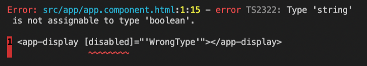
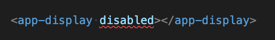
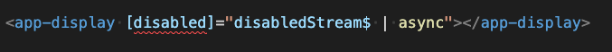

<style>
img[alt~="center"] {
  display: block;
  margin: 0 auto;
}
</style>

# **Strict Components**

Are your components ready to be used in a `strict:true` application?

---


---

# Strict by default

For all new Angular Applications the typescript flag `strict` is enabled by default.

Including full template checking of @Input / @Output types



---
# The problem

Why do we have to talk about this? 

Because surprisingly just setting the correct types isn't actually enough!

```ts


// This will not be enough for strict applications
@Input()
public disabled: boolean = false;


```

---

 # Our Component

 ```ts


export class DisplayComponent {
  @Input()
  public disabled: boolean = false;
}


 ```
Explicit binding of a boolean value is ok

 ```html

  <app-display [disabled]="true" ></app-display>


 ```
But what about supporting plain attributes?

 ```html
<app-display disabled ></app-display>
 ```
---

# disabled is not boolean



```py


Error: app.component.html:1:14 - error TS2322: Type 'string' is not assignable to type 'boolean'.


```
 Because this is actually equivalent to:

 ```html


  <app-display [disabled]="''" ></app-display>


 ```

 ---

 # Input Coercion

We need to perform Input Coercion to accept plain attributes as boolean.

There are two approaches depending on your Angular / Typescript version

 - `ngAcceptInputType_` Angular v9-14
 - Set / Get with different Types
   - Typescript [v4.3](https://devblogs.microsoft.com/typescript/announcing-typescript-4-3/#separate-write-types) / Angular v13+

 ---

 # ngAcceptInputType

Static property supported by Angular compiler that enables you to widen the accepted types of an Input property.

```ts

@Input()
public disabled: boolean = false;
// Also accept the empty string in addition to boolean values
static ngAcceptInputType_disabled: boolean | '';


```

Supported Angular v9-14

---

 # ngAcceptInputType

```ts
static ngAcceptInputType_disabled: boolean | '';
```

This code now compiles with no errors.

```html


  <app-display disabled ></app-display>
 
 
 ```

**But we have to remember to convert the empty string to true!**

---

 # ngAcceptInputType Input Coercion via OnChanges
  
Convert as part of update from `ngOnChanges`

```ts

ngOnChanges(changes: SimpleChanges) {
    if (changes.disabled) {
        this.disabled = toBoolean(changes.disabled.currentValue);
    }
}

toBoolean(value: boolean | string) {
    this.disabled = (value === '') || value === true;
}


```

---

# ngAcceptInputType Examples

Works for other types too. 

Accept Dates as strings for example

```ts


@Input()
public date: Date;
static ngAcceptInputType_date: Date | string;

ngOnChanges(changes: SimpleChanges) {
    if (changes.date) {
        this.date = toDate(changes.date.currentValue); 
    }
}

```

---

# Set / Get with different Types

Typescript 4.3 supports different Set and Get types

```ts

  _disabled: boolean = false;

  @Input()
  get disabled(): boolean {
    return this._disabled;
  }
  set disabled(value: boolean | string | null) {
    this._disabled = toBoolean(value);
  }


```

No need for ngAcceptInputType anymore hence its deprecation

---

# What about async pipe?

Now what if our user wants to set disabled state from an Observable stream?



Another error! 

```ts

disabledStream$: Observable<boolean>;

```


```py


   Type 'null' is not assignable to type 'boolean | ""'


```

Async pipe can return `null` if no value emitted yet.

---
# Supporting async pipe with ngAcceptInputType_

Update our `ngAcceptInputType_disabled` to handle null too.

```ts

static ngAcceptInputType_disabled: boolean | '' | null;


```

Validate that your toBoolean(value: any) function handles null

---

# Supporting async pipe with Set / Get

Update our setter to handle null.

```ts
  set disabled(value: boolean | string | null) {
    this._disabled = toBoolean(value);
  }
```

---

# What if its not your component?

Non null assertion
```html
<app-display [disabled]="(disabledStream$ | async)!"
```

Disable type checking with `$any()`
```html
<app-display [disabled]="$any(disabledStream$ | async)" 
```

Provided a default value
```html
<app-display [disabled]="(disabledStream$ | async) || false" 
```

--- 

# Tweak tsConfig angularCompilerOptions

Stop strict null errors just for Inputs
```json
"angularCompilerOptions": { "strictNullInputTypes": false }
```

Turn off all input checking. (Not recommended)
```json
"angularCompilerOptions": { "strictInputTypes": true }
```

Full list available under [Troubleshooting template errors](https://angular.io/guide/template-typecheck#troubleshooting-template-errors)

---

# What if its not your component?

Create an Issue for the library to fix their types! :)


---